# OPREC Admin NETICS Modul 1 - CICD

- **Nama:** Raynald Ramadhani Fachriansyah
- **NRP:** 5025241020

## Deskripsi Soal

Soal dapat diakses di [sini](https://its.id/m/netics-oprec-2026-module1).

Pada tugas modul 1 ini, kami diminta untuk mengimplementasikan modul CI/CD ini pada sebuah sistem server sederhana, dengan detail sebagai berikut:

1. Membuat API publik dengan endpoint `/health` nama, NRP, status server, waktu sekarang, dan lama server menyala.
2. Deploy API tersebut di dalam docker container di VPS dengan menggunakan port selain 80 dan 443.
3. Menggunakan Ansible untuk menginstall dan meletakkan konfigurasi nginx pada VPS.
4. Setup Github Action untuk melakukan otomatisasi proses deployment API.

## Tech Stack

| Teknologi             | Kegunaan                                                                   |
| --------------------- | -------------------------------------------------------------------------- |
| **Node.js + Express** | Bahasa dan framework untuk pembuatan API                                   |
| **Docker**            | Containerization untuk deployment API                                      |
| **DigitalOcean**      | VPS publik tempat API di-deploy                                            |
| **Ansible**           | Automation tool untuk pengaturan VPS                                       |
| **Nginx**             | Reverse Proxy untuk meneruskan request dari port 80 ke container port 8080 |
| **Github Actions**    | CI/CD pipeline untuk otomatisasi deployment                                |

## Penjelasan Alur Pengerjaan

### 1. Membuat API dengan Node.js + Express

File: [src/index.js](./src/index.js)

```javascript
const express = require("express");
const app = express();
const PORT = process.env.PORT || 8080;

app.get("/health", (req, res) => {
  res.json({
    nama: "Sersan Mirai Afrizal",
    nrp: "5025241999",
    status: "UP",
    timestamp: newDate().toISOString(),
    uptime: `${Math.floor(process.uptime())}s`,
  });
});

app.listen(PORT);
```

- `process.env.PORT || 8080` -> setup port fleksibel dengan fallback ke 8080.
- `newDate().toISOString()` -> menghasilkan timestamp dalam standar UTC.
- `process.uptime()` -> digunakan untuk mendapatkan uptime server secara native.

#### Testing API & Dokmentasi Testing

Sebelum lanjut ke tahap selanjutnya, kita harus memastikan API berjalan dengan baik di lokal dan ouputnya sesuai dengan yang dibutuhkan. Testing API lokal dijalankan menggunakan:

1. Run server:

```bash
node src/index.js
```


2. Curl endpoint:

```bash
curl http://localhost:8080/health
```

## 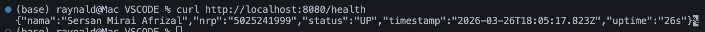

**Kesimpulan**

Dari hasil testing, output API berhasil berjalan sesuai dengan yang diharapkan, maka kita bisa lanjut ke tahap selanjutnya.

### 2. Dockerize API

File: [src/Dockerfile](./src/Dockerfile)

```dockerfile
FROM node:20-alpine

WORKDIR /app

COPY package*.json ./

RUN npm install --production

COPY . .

EXPOSE 8080

CMD ["node", "index.js"]
```

- Saya menggunakan image `node:20-alpine` untuk ukuran yang ringan dan stabil.
- `EXPOSE 8080` -> mendeklarasikan port yang digunakan oleh container.

File: [src/docker-compose.yml](./src/docker-compose.yml)

```yaml
services:
  api:
    build: .
    container_name: health-api
    ports:
      - "8080:8080"
    restart: unless-stopped
```

- Dibuat untuk testing docker di lokal.

#### Testing Docker & Dokumentasi Testing

Kita perlu memastikan docker container berjalan dan API bisa diakses melalui docker dengan benar.

1. Build dan run container:

```bash
cd src
docker-compose up -d
```

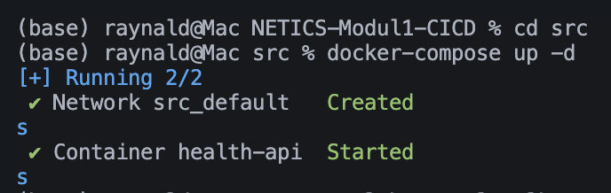

2. Curl endpoint:

```bash
curl http://localhost:8080/health
```

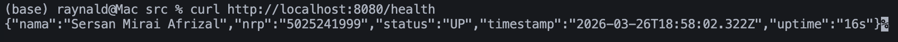

3. Cek container yang berjalan:

```bash
docker ps
```

## 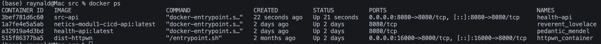

**Kesimpulan**

Karena docker sudah berjalan dengan baik dan API bisa diakses melalui container, maka kita bisa lanjut ke tahap berikutnya.

### 3. Setup VPS (DigitalOcean Droplet)

Detail VPS:

- Virtual Machine Ubuntu 22.04 LTS (Singapore)
- 1 vCPU, 1GB RAM
- Authentication menggunakan SSH key `ed25519`
- Membuka port 22, 80, dan 8080 di firewall.

Setelah berhasil membuat VPS, saya menginstall Docker di VPS dengan perintah:

```bash
apt update
apt install -y ca-certificates curl gnupg
install -m 0755 -d /etc/apt/keyrings
curl -fsSL https://download.docker.com/linux/ubuntu/gpg -o /etc/apt/keyrings/docker.asc
chmod a+r /etc/apt/keyrings/docker.asc

echo \
  "deb [arch=$(dpkg --print-architecture) signed-by=/etc/apt/keyrings/docker.asc] https://download.docker.com/linux/ubuntu \
  $(. /etc/os-release && echo "$VERSION_CODENAME") stable" | \
  tee /etc/apt/sources.list.d/docker.list > /dev/null

apt update
apt install -y docker-ce docker-ce-cli containerd.io docker-compose-plugin
```

Untuk best practice, saya menggunakan user tertentu untuk SSH dan menjalankan container agar root tidak digunakan secara langsung, berikut tahapan setup user dan permission:

```bash
ssh root@206.189.94.197

adduser --disabled-password --gecos "" deploy

usermod -aG docker deploy

mkdir -p /home/deploy/.ssh
cp /root/.ssh/authorized_keys /home/deploy/.ssh/
chown -R deploy:deploy /home/deploy/.ssh
chmod 700 /home/deploy/.ssh
chmod 600 /home/deploy/.ssh/authorized_keys
```

Karena Ansible membutuhkan akses udo untuk mengkonfigurasi ngix, maka user `deploy` perlu diberikan akses sudo tanpa password, tapi tetap dengan batasan hanya untuk perintah yang diperlukan:

```bash
echo "deploy ALL=(ALL) NOPASSWD:ALL" > /etc/sudoers.d/deploy
chmod 440 /etc/sudoers.d/deploy

chsh -s /usr/sbin/nologin root
```

#### Testing VPS & Dokumentasi Testing

Kita perlu pastikan VPS bisa diakses dengan SSH, Docker terinstall dengan benar, dan port yang dibutuhkan sudah terbuka.

1. Pengecekan root login dan Docker:

```bash
ssh root@206.189.94.197

docker --version

ufw status
```

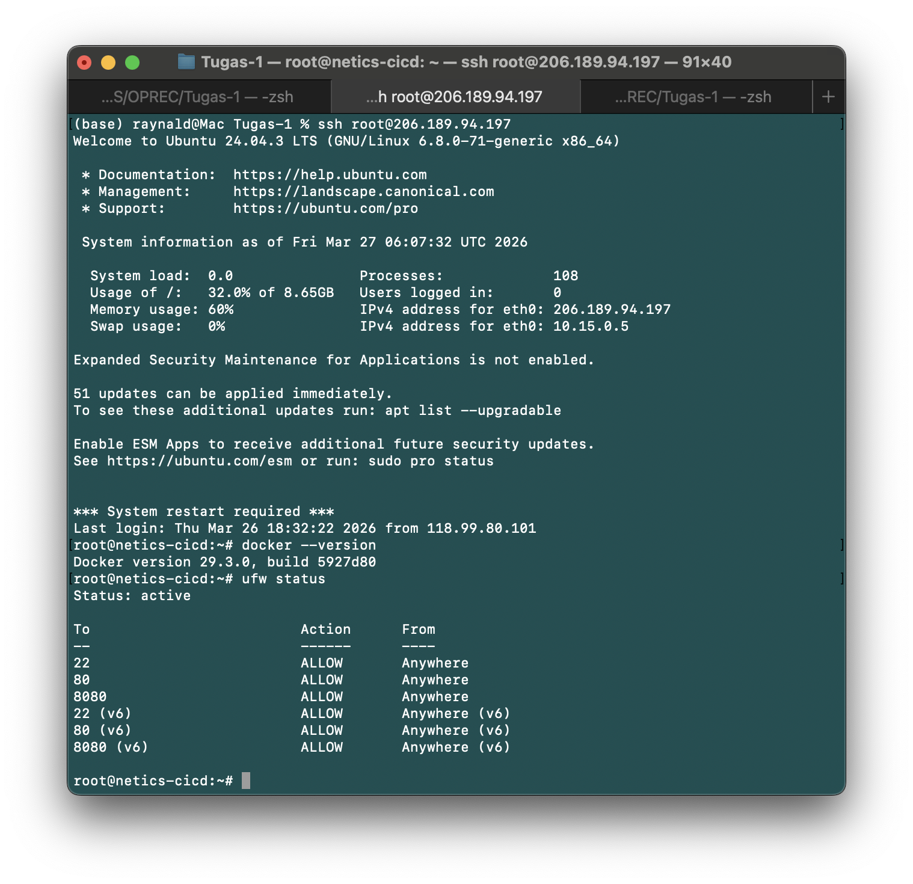

2. Pengecekan user `deploy` dan permission Docker:

```bash
ssh deploy@206.189.94.197

docker --version
```

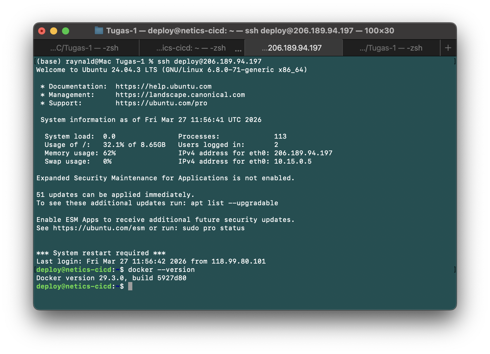

**Kesimpulan**

VPS sudah berhasil dibuat dan bisa diakses lewat SSH untuk root dan user `deploy`, Docker sudah terinstall, dan port yang dibutuhkan sudah terbuka, maka kita bisa lanjut ke tahap berikutnya.

---

### 4. Setup nginx dengan menggunakan Ansible

Pada pengerjaan tugas ini, kita diwajibkan untuk menggunakan Ansible untuk install dan mengkonfigurasi nginx di VPS.

Struktur direktori Ansible:

```
src/ansible/
├── templates/
│   └── nginx.conf.j2
├── inventory.ini
└── playbook.yml
```

File [ansible/inventory.ini](./src/ansible/inventory.ini):

```ini
[vps]
netics-cicd ansible_host=206.189.94.197 ansible_user=deploy ansible_ssh_private_key_file=~/.ssh/id_ed25519
```

- `ansible_host` -> IP address VPS yang akan dikelola Ansible.
- `ansible_user` -> user yang digunakan untuk SSH (deploy).
- `ansible_ssh_private_key_file` -> path ke SSH key yang digunakan untuk autentikasi.

File [ansible/templates/nginx.conf.j2](./src/ansible/templates/nginx.conf.j2):

```nginx
server {
    listen 80;

    location / {
        proxy_pass http://localhost:8080;
        proxy_http_version 1.1;
        proxy_set_header Host $host;
        proxy_set_header X-Real-IP $remote_addr;
        proxy_set_header X-Forwarded-For $proxy_add_x_forwarded_for;
    }
}
```

- Konfigurasi nginx untuk forward request dari port 80 ke port 8080 tempat API berjalan.

File [ansible/playbook.yml](./src/ansible/playbook.yml):

```yaml
---
- name: Setup nginx reverse proxy
  hosts: vps
  become: true

  tasks:
    - name: Install nginx
      apt:
        name: nginx
        state: present
        update_cache: yes

    - name: Copy nginx config
      template:
        src: templates/nginx.conf.j2
        dest: /etc/nginx/sites-available/default
        owner: root
        group: root
        mode: "0644"

    - name: Remove default nginx symlink
      file:
        path: /etc/nginx/sites-enabled/default
        state: absent

    - name: Enable nginx config
      file:
        src: /etc/nginx/sites-available/default
        dest: /etc/nginx/sites-enabled/default
        state: link

    - name: Start and enable nginx
      service:
        name: nginx
        state: restarted
        enabled: yes
```

- Urutan task nya adalah install nginx, copy konfigurasi, setup symlink, dan restart service nginx.

Cara menjalankan Ansible playbook:

```bash
cd src/ansible
ansible-playbook -i inventory.ini playbook.yml
```

#### Testing Ansible & Dokumentasi Testing

1. Ekspektasi output Ansible playbook berjalan dengan benar:

```
PLAY RECAP ***************************
netics-cicd : ok=6  changed=5  unreachable=0  failed=0  skipped=0  rescued=0  ignored=0
```

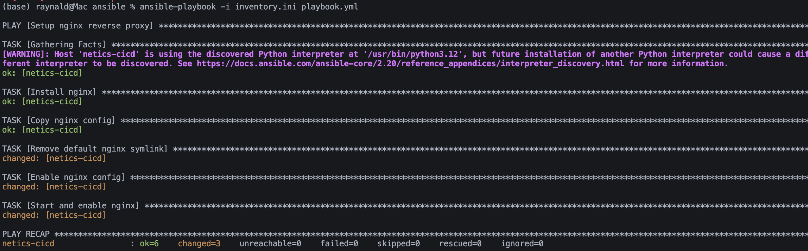

2. Run docker container di VPS:

```bash
ssh deploy@206.189.94.197

docker run -d \
  --name health-api \
  --restart unless-stopped \
  -p 8080:8080 \
  rrraynald/netics-modul1-cicd-api:latest
```

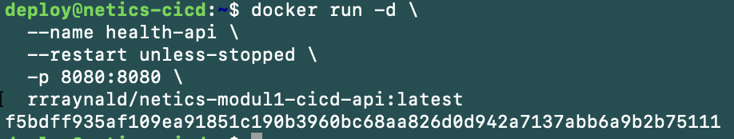

3. Test nginx forwarding dengan curl dari VPS:

```bash
curl http://localhost/health
```

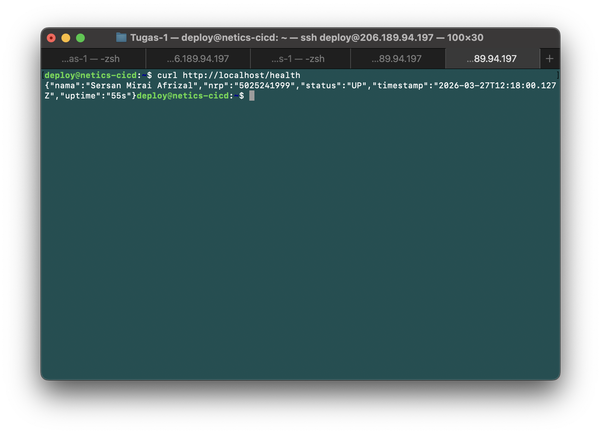

4. Test nginx forwarding dari lokal:

```bash
curl http://206.189.94.197/health
curl http://206.189.94.197:8080/health
```

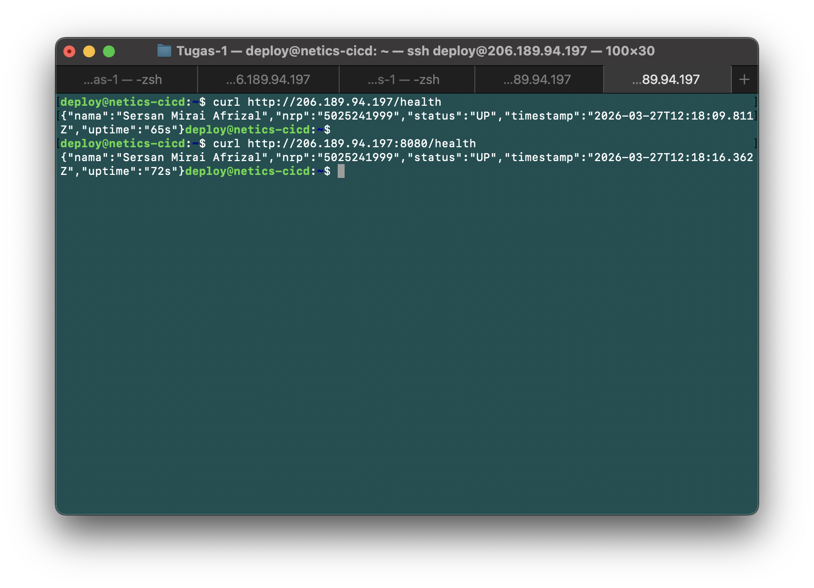

**Kesimpulan**

Ansible playbook berhasil dijalankan, nginx berhasil diinstal, API bisa diakses melalui nginx di port 80, dan juga bisa diakses langsung ke port 8080, maka kita bisa lanjut ke tahap berikutnya.

---

### 5. CI/CD Pipeline dengan Github Actions

File: [.github/workflows/autodeploy.yml](./.github/workflows/autodeploy.yml)

```yaml
name: CI/CD Pipeline

on:
  push:
    branches:
      - main

jobs:
  test:
    name: Test
    runs-on: ubuntu-latest
    steps:
      - name: Checkout code
        uses: actions/checkout@v4.2.2

      - name: Setup Node.js
        uses: actions/setup-node@v4.3.0
        with:
          node-version: "20"
          cache: "npm"
          cache-dependency-path: src/package-lock.json

      - name: Install dependencies
        working-directory: src
        run: npm install

      - name: Run tests
        working-directory: src
        run: |
          node index.js &
          sleep 2
          curl --fail http://localhost:8080/health

  build-and-push:
    name: Build & Push Docker Image
    runs-on: ubuntu-latest
    needs: test
    permissions:
      contents: read
      packages: write
    steps:
      - name: Checkout code
        uses: actions/checkout@v4.2.2

      - name: Set up Docker Buildx
        uses: docker/setup-buildx-action@v3.10.0

      - name: Login to Docker Hub
        uses: docker/login-action@v3.4.0
        with:
          username: ${{ secrets.DOCKERHUB_USERNAME }}
          password: ${{ secrets.DOCKERHUB_TOKEN }}

      - name: Extract Docker metadata
        id: meta
        uses: docker/metadata-action@v5.7.0
        with:
          images: rrraynald/netics-modul1-cicd-api
          tags: |
            type=sha
            type=raw,value=latest

      - name: Build and push Docker image
        uses: docker/build-push-action@v6.15.0
        with:
          context: ./src
          push: true
          tags: ${{ steps.meta.outputs.tags }}
          platforms: linux/amd64
          cache-from: type=gha
          cache-to: type=gha,mode=max

  deploy:
    name: Deploy to VPS
    runs-on: ubuntu-latest
    needs: build-and-push
    steps:
      - name: Deploy via SSH
        uses: appleboy/ssh-action@v1.0.3
        with:
          host: ${{ secrets.VPS_HOST }}
          username: ${{ secrets.VPS_USER }}
          key: ${{ secrets.SSH_PRIVATE_KEY }}
          script: |
            docker pull rrraynald/netics-modul1-cicd-api:latest
            docker stop health-api || true
            docker rm health-api || true
            docker run -d \
              --name health-api \
              --restart unless-stopped \
              -p 8080:8080 \
              rrraynald/netics-modul1-cicd-api:latest

      - name: Verify deployment
        uses: appleboy/ssh-action@v1.0.3
        with:
          host: ${{ secrets.VPS_HOST }}
          username: ${{ secrets.VPS_USER }}
          key: ${{ secrets.SSH_PRIVATE_KEY }}
          script: |
            sleep 5
            curl --fail http://localhost:8080/health
```

- Workflow ini akan berjalan setiap kali ada push ke branch `main`.

**Alur Pipeline**

```
Push ke main
    ↓
[Test] — jalankan server, curl /health
    ↓ gagal = stop
[Build & Push] — build image linux/amd64, push ke Docker Hub
    ↓ gagal = stop
[Deploy] — SSH ke VPS, pull image terbaru, restart container
    ↓
[Verify] — curl /health di VPS memastikan deployment sukses
```

**Best Practices yang diterapkan**

- Job `test` berjalan sebelum `deploy` sebagai quality gate.
- Docker image di-tag dengan SHA dan `latest` untuk fleksibilitas.
- Docker layer cache dengan `type-gha` untuk mempercepat build berikutnya.
- Credentials disimpan di GitHub Secrets untuk keamanan.
- Platform `linux/amd64` untuk kompatibilitas dengan VPS yang digunakan, terutama karena saya menggunakan Mac Apple Silicon, jadi ketika tidak di specify akan crash.
- Menggunakan `restart: unless-stopped` untuk memastikan container tetap berjalan di VPS.

#### Testing CI/CD Pipeline & Dokumentasi Testing

Kita perlu memastikan pipeline berjalan dengan baik, saya melakukannya dengan cara:

1. Lakukan beberapa perubahan pada API untuk mengetes proses ini lalu push changes ke github:

```bash
git add .
git commit -m "testing CI/CD pipeline"
git push origin main
```

2. Cek status workflow di GitHub Actions tab dan pastikan semua job berhasil dan tidak error.

3. Cek hasilnya dengan curl ke VPS:

```bash
curl http://206.189.94.197:8080/health
```


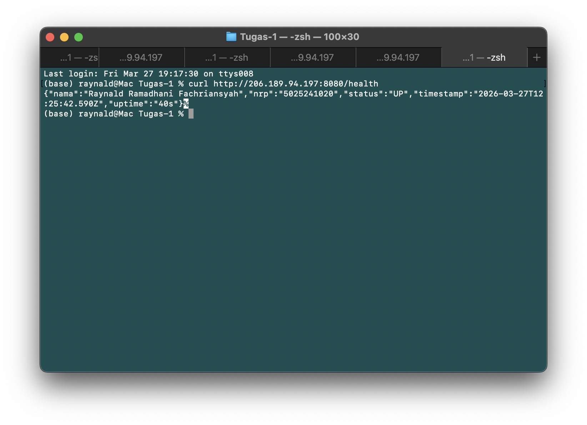
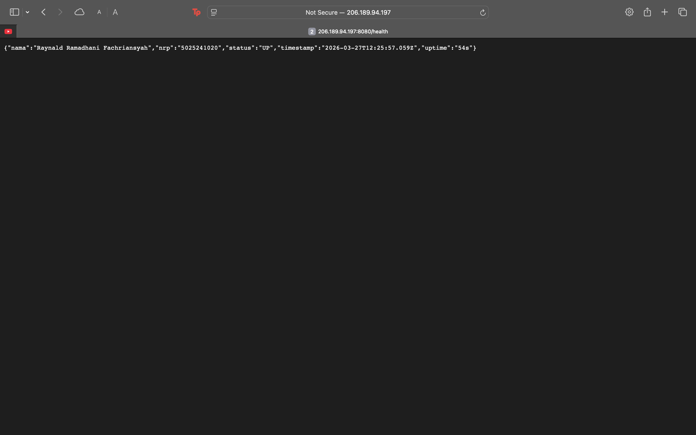

4. Lakukan perubahan kembali ke awal lagi untuk memastikan pipeline berjalan konsisten, lalu push lagi ke github dan cek hasilnya.

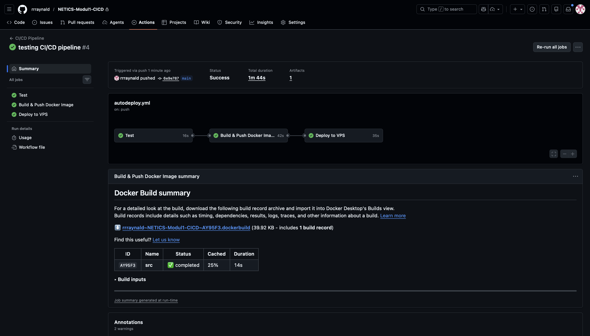
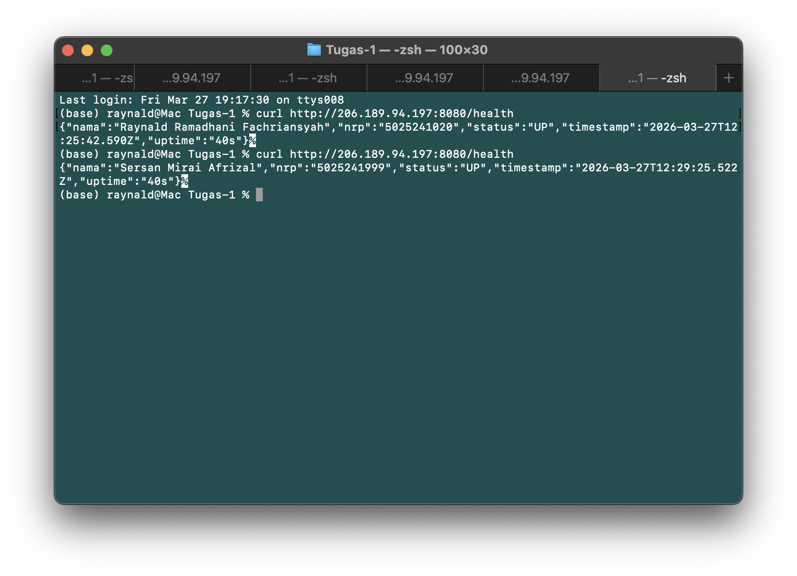
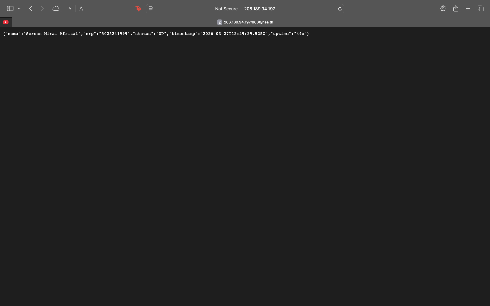

**Kesimpulan**

Pipeline berhasil berjalan dengan baik, setiap perubahan yang di-push ke `main` akan melewati proses testing, build, push, dan deploy secara otomatis, serta hasilnya bisa langsung dilihat di VPS.

---

## Referensi

| Sumber                        | Link                                                                                                              |
| ----------------------------- | ----------------------------------------------------------------------------------------------------------------- |
| Node.js + Express             | https://www.geeksforgeeks.org/node-js/how-to-create-and-run-node-js-project-in-vs-code-editor/                    |
| Docker & Containerize Node.js | https://www.hostinger.com/tutorials/how-to-use-node-js-with-docker                                                |
| Docker install Ubuntu         | https://docs.docker.com/engine/install/ubuntu/                                                                    |
| DigitalOcean Droplet setup    | https://docs.digitalocean.com/products/droplets/                                                                  |
| Ansible playbook              | https://dev.to/dpuig/creating-an-ansible-playbook-to-install-and-configure-nginx-for-hosting-static-websites-3n6j |
| GitHub Actions documentation  | https://docs.github.com/en/actions                                                                                |
| actions/checkout              | https://github.com/marketplace/actions/checkout                                                                   |
| actions/setup-node            | https://github.com/marketplace/actions/setup-node-js-environment                                                  |
| docker/setup-buildx-action    | https://github.com/marketplace/actions/docker-setup-buildx                                                        |
| docker/login-action           | https://github.com/marketplace/actions/docker-login                                                               |
| docker/metadata-action        | https://github.com/marketplace/actions/docker-metadata-action                                                     |
| docker/build-push-action      | https://github.com/marketplace/actions/build-and-push-docker-images                                               |
| appleboy/ssh-action           | https://github.com/marketplace/actions/ssh-remote-commands                                                        |
| AI assistance — ChatGPT       | https://chatgpt.com/share/69c67bb5-561c-8322-8e6d-601f8cbedd11                                                    |
